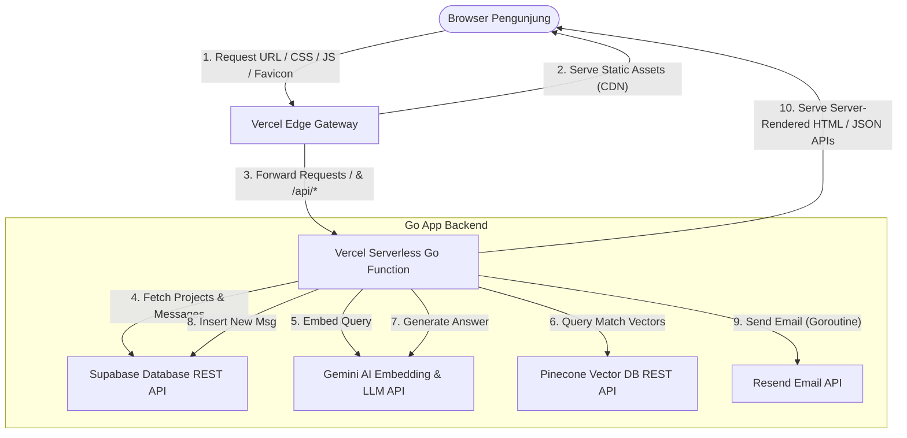

# 🏛️ System Architecture Guide

Dokumen ini menjelaskan struktur proyek, arsitektur sistem, dan alasan pemilihan teknologi yang digunakan untuk refactoring portfolio **Najin Kyou** (`NajinKyou`).

---

## 1. Project Directory Structure

Setelah migrasi selesai, struktur proyek akan menjadi sangat bersih, minimalis, dan mudah dipahami:

```
NajinKyou/
├── api/
│   ├── templates/
│   │   └── index.html       # Single Page HTML Template (Embedded)
│   └── index.go             # Main Vercel Serverless Go Handler & API Endpoints
├── cmd/
│   └── dev/
│       └── main.go          # Dev Runner (Local development server)
├── docs/
│   ├── architecture.md      # Panduan Arsitektur (Dokumen Ini)
│   ├── deployment.md        # Panduan Deployment ke Vercel & GitHub CI/CD
│   └── guestbook.md         # Panduan Setup Database Supabase
├── public/
│   ├── css/
│   │   └── main.css         # Custom Vanilla CSS Design System & Theme Styles
│   ├── js/
│   │   └── main.js          # Client-Side Interactions, Canvas, and AJAX APIs
│   └── favicon.ico          # Website Favicon
├── go.mod                   # Go Modules definition
└── vercel.json              # Vercel Serverless Router Configurations
```

---

## 2. Technical Stack Evaluation

Kami memigrasikan seluruh aplikasi dari Next.js ke **Go (Golang) + Vanilla CSS + Vanilla JS**. Berikut adalah alasan teknis di balik pilihan ini:

### A. Go (Golang) Backend
* **Cold Starts Sangat Cepat:** Go dikompilasi menjadi binary native berukuran kecil. Cold start serverless Go di Vercel berada di bawah **200ms**, jauh lebih cepat dibandingkan runtime Node.js/Next.js yang membutuhkan waktu parsing JS.
* **Performa Tinggi & Memory Footprint Kecil:** Go mengonsumsi memori minimal (biasanya < 15MB di serverless container), menghemat resource dan mencegah runtime crashes.
* **Concurrency Handal:** Go menangani request API secara efisien lewat goroutine (misal: pengiriman email notifikasi via goroutine di latar belakang agar request client tidak terhambat).

### B. Supabase REST API (PostgREST)
* **Bebas Pool Exhaustion:** Koneksi database TCP tradisional (seperti `pg` di Node.js) rentan mengalami *pool exhaustion* pada sistem serverless karena container yang membesar membuka koneksi baru terus-menerus. Supabase menyediakan REST API bawaan (PostgREST) berbasis HTTPS, yang stateless dan secara natural berskala tanpa batas di lingkungan serverless.
* **Performa Maksimal:** REST API Supabase sangat cepat karena dikompilasi langsung di sisi server C Postgres. Kami memanggil API ini menggunakan pustaka standar Go `net/http`.

### C. Zero-Dependency RAG Assistant
* Kami membangun RAG pipeline tanpa menggunakan kerangka kerja berat seperti LangChain JS.
* Di sisi backend Go, kami memanggil API REST Pinecone dan API REST Google Gemini secara langsung lewat HTTP request.
* Ini menghasilkan kecepatan parsing query yang luar biasa cepat dan menghilangkan ratusan megabyte modul JavaScript dari folder deployment.

### D. Vanilla CSS & JS Sisi Klien
* **Zero-Hydration Overhead:** Tidak ada React Virtual DOM atau file bundle JavaScript besar yang harus diunduh dan diproses di browser pengunjung. Halaman web langsung interaktif sejak byte pertama diterima.
* **Estetika Premium Minimalis:** CSS dirancang menggunakan variabel HSL yang responsif terhadap tema gelap/terang, tipografi yang kuat (`Cormorant Garamond` & `Space Grotesk`), grain overlay, dan efek micro-animation yang halus.

---

## 3. Data Flow Diagram

Alur interaksi sistem digambarkan melalui diagram berikut:



---

## 4. Key Security & Limit Implementations

1. **Guestbook Spam Prevention (Honeypot):** Form guestbook dilengkapi input tersembunyi `g-hp-input`. Jika robot otomatis mengisi form tersebut, request akan diblokir tanpa diproses.
2. **Rate Limiting Sisi Server:** Setiap IP dibatasi maksimum mengirimkan **3 pesan guestbook per 10 menit** menggunakan in-memory rate-limiter thread-safe Go untuk mencegah serangan spamming database.
3. **Input Sanitization:** Karakter-karakter berbahaya (seperti `<` dan `>`) disaring secara ketat sebelum dimasukkan ke database untuk mencegah serangan *Cross-Site Scripting* (XSS) dan *SQL Injection*.
4. **Fallback Database:** Jika database Supabase lambat merespons atau sedang down saat rendering awal halaman, Go backend secara otomatis menggunakan data fallback statis (`seedProjects` & `fallbackMessages`) agar situs web tetap dapat terbuka secara instan.
